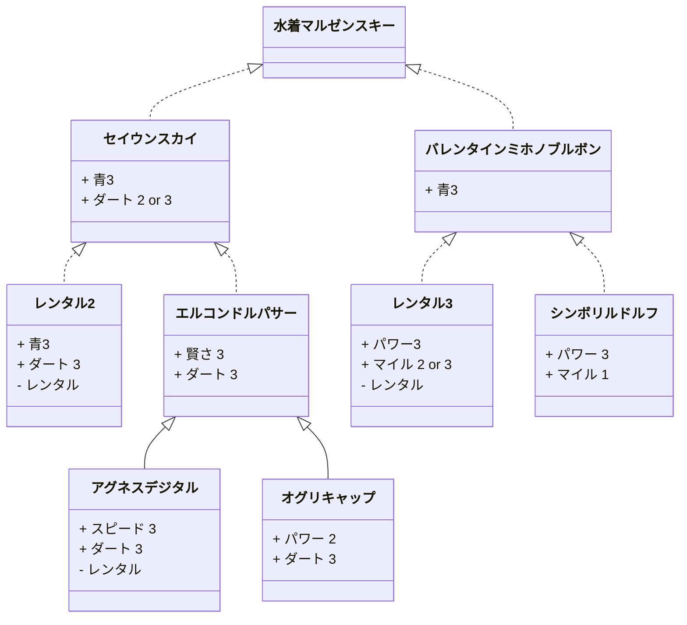

## 0.35.11.2 (2022/02)

### iutest 関連

* C++ Core Guidlines Check に対応中 https://github.com/srz-zumix/iutest/pull/627
* gcc -fanalyzer の実行環境を模索中

### OSS 関連

* https://github.com/jenkinsci/configuration-as-code-plugin/pull/1904
  * JCasC の Oerride Merge Strategy で複数のキーを含むファイルのマージで例外が出るのを修正
* GitHub Actions 上で Jenkins を扱う研究をはじめました
  * https://github.com/srz-zumix/setup-service-jenkins
  * [jflint example](https://github.com/srz-zumix/github-actions-sample/blob/main/.github/workflows/reviewdog-jflint.yml)

### ブログ/執筆

* [ブログズミ](https://srz-zumix.blogspot.com/2022/02/) 
  * [メモリ不足で gcc が kill される場合になんとかビルドする](https://srz-zumix.blogspot.com/2022/02/gcc-kill.html)
  * [gcc -fanalyzer が実行しきれる CI サービスを求めて・・・](https://srz-zumix.blogspot.com/2022/02/gcc-fanalyzer-ci.html)

### その他

* 新型コロナワクチン3回目接種しました
  * 交互接種が良いと言われてたのでモデルナ→モデルナ→ファイザーにしましたが、モデルナ3回でも（のほうが）良かった？
  * 副反応はファイザーが圧倒的に少なかった
  * なんにせよ気をつけて生活するのは変わらないので終息を願う
* Integromat が Make になったので移行して試したい
* GitHub で Mermaid 記法が使えるようになったのでテスト

## 0.35.10.1 (2022/01)

### iutest 関連

* C++ Core Guidlines Check に対応中 https://github.com/srz-zumix/iutest/pull/627

### OSS 関連

* [wandbox-api][]
  * 新しい [Wandbox][] 環境に対応
  * [Wandbox Status][] もあわせて更新

### ブログ/執筆

* [ブログズミ](https://srz-zumix.blogspot.com/2022/01/) 
　　　* [bash スクリプトの実行中上書き動作が ansible copy module で再現するのか試してみた](https://srz-zumix.blogspot.com/2022/01/bash-ansible-copy-module.html)
　　　* [GitHub Actions の action 開発者にお願いしたいメジャーバージョンアップするタイミング](https://srz-zumix.blogspot.com/2022/01/github-actions-action.html)
　　　* [wandbox-api version 0.9.38 をリリースしました](https://srz-zumix.blogspot.com/2022/01/wandbox-api-version-0938.html)

### その他

* 初めて御節を買ったけど良かった
* 最近は Jenkins をまた弄っている

## 0.35.9.12 (2021/12)

### iutest 関連

* C++ Core Guidlines Check に対応中 https://github.com/srz-zumix/iutest/pull/627

### OSS 関連

* [wandbox-api][]
  * OpenSSL の head がない場合があったので修正
  * Go でローカルモジュール（相対パス）に対応 
* [tails-of-words][]
  * html2text でリンクを展開したときに URL をマークダウン形式で展開しないように修正 

### ブログ/執筆

* [ブログズミ](https://srz-zumix.blogspot.com/2021/12/)
  * [CircleCI の Concurrency と Parallelism](https://srz-zumix.blogspot.com/2021/12/circleci-concurrency-parallelism.html)
  * [Facebook 改め Meta 社の静的解析ツール Infer を GitHub Actions でかける](https://srz-zumix.blogspot.com/2021/12/facebook-meta-infer-github-actions.html)
  * [Visual Studio でライブラリなど外部コードの警告を出さないようにする方法](https://srz-zumix.blogspot.com/2021/12/visual-studio.html)
  * [GitHub で草生やさないようにする](https://srz-zumix.blogspot.com/2021/12/github.html)

### その他

* 最近執筆のペースがよくないんですがなんとか今年もアドベントカレンダー記事が書けました
  * 本当は Core Guidelines Check のこと書きたかったけどそのうち・・
* 健康アプリはやらないけどピクミンブルームはやってる
  * 大分歩くことに慣れてきた。前は絶対徒歩では行かない場所にも抵抗なくなってきた
  * といってもだいたいの日が 11 歩とか 18 歩とかなので大丈夫かな？と思ってくる  
* 2021年もありがとうございました。2022年もよろしくおねがいします。

## 0.35.8.11 (2021/11)

### iutest 関連

* C++ Core Guidlines Check に対応中 https://github.com/srz-zumix/iutest/pull/627

### OSS 関連

* [docker-luau][]
  * Roblox の luau を dockerize
* [setup-infer][] / [action-infer][]
  * Facebook の静的解析ツール infer のセットアップおよび reviewdog アクションを作成

### ブログ/執筆

* [ブログズミ](https://srz-zumix.blogspot.com/2021/11/)
  * [【OSS】Miro 風ホワイトボード ourboard を立ててみる](https://srz-zumix.blogspot.com/2021/11/ossmiro-ourboard.html)
  * [xcpretty で compile_commands.json を出力しても空になってしまう理由がわかった！](https://srz-zumix.blogspot.com/2021/11/xcpretty-compilecommandsjson.html)
  * [master/main 混在している git submodule すべてをデフォルトブランチ最新にする](https://srz-zumix.blogspot.com/2021/11/mastermain-git-submodule.html)

### その他

* GitHub の草が定期ジョブのコミットを集計してしまっていたのを直した
* こたつ出した
* もう AdventCalender の時期か。書きたいけど書けるかな？
* SREな記事を書いてるけど進捗ダメです

## 0.35.7.10 (2021/10)

### iutest 関連

* [IUTEST_ASSERT_EXIT が DeathTest の ASSERT_EXIT と命名ルールが被っている](https://github.com/srz-zumix/iutest/issues/618)

### OSS 関連

* [tails-of-words][] v1.0 をリリース
  * やりたいこはやりきったと思うので 1.0 リリースして開発終了しました
* [textlint-plugin-review-starter][] v0.1.4 リリース
  * 行頭空白を含む用語リストに対応
  * dependabot 導入

### ブログ/執筆

* [ブログズミ](https://srz-zumix.blogspot.com/2021/10/)
  * [Tails of Words v0.3.0 リリース](https://srz-zumix.blogspot.com/2021/10/tails-of-words-v030.html)
  * [Process Flow Diagram を GitHub Actions で書いてみた](https://srz-zumix.blogspot.com/2021/10/process-flow-diagram-github-actions.html)
  * [「自分リリースノート」を一年書いてみた](https://srz-zumix.blogspot.com/2021/10/blog-post.html)
  * [npm-groovy-lint + reviewdog で Jenkins Shared Library の PR チェック](https://srz-zumix.blogspot.com/2021/10/npm-groovy-lint-reviewdog-jenkins.html)
  * [Docker な Jenkins でプラグインインストール済みイメージを作る](https://srz-zumix.blogspot.com/2021/10/docker-jenkins.html)

### その他

* Tales of ARISE クリアしました
  * トロフィーコンプリートもしてます
  * スキットと入手アイテムが 100% にならなかったので２周目突入するもやる気おきずに終了
  * 収集率100%にならなくてもトロフィーコンプリートできるのは嬉しいっちゃ嬉しいがやる理由がなくなってしまった
  * ごちそうさまでした
* NEW GAME! 最終巻を読みました
  * 収納ボックスつきのを買って先月には手元にあったんですが、読んだら終わってしまうと思ってなかなか読めてませんでした
  * 一番思い入れ深いのは八神コウがフランスへ行くあたりですね。ちょうど自身の転職時期と重なっていて、不安な気持ちを抱えていましたが、まぁなんとかなるっしょと後押ししてもらったなと思います
  * そして１巻から読み直しました。アニメの楽曲を垂れ流しながら。本当に前向きな気持ちになれますね
  * 明日も一日がんばるぞい！ 
* GitHub Actions で毎日自動コミットしているやつを GitHub の草に反映されないようにしたいのですが方法しってる方いませんか？

## 0.35.6.9 (2021/09)

### iutest 関連

* [std::complex に対応](https://github.com/srz-zumix/iutest/pull/621)

### OSS 関連

* [tails-of-words v0.3.0](https://github.com/srz-zumix/tails-of-words/releases/tag/v0.3.0) をリリースしました

### ブログ/執筆

* [ブログズミ](https://srz-zumix.blogspot.com/2021/09/)
  * [GitHub Actions でペアな値のマトリックスを組む](https://srz-zumix.blogspot.com/2021/09/github-actions.html)
  * [CEDEC でやってた表記ゆれ検出をお試し実装してみた](https://srz-zumix.blogspot.com/2021/09/cedec.html)
  * [GitHub Actions Composite Action で uses が使えるようになった！ ](https://srz-zumix.blogspot.com/2021/09/github-actions-composite-action-uses.html)

### その他

* シルバーウィークから Tales of ARISE をやってます（もうちょいでクリアだと思う）

## 0.35.5.8 (2021/08)

### iutest 関連

* [CircleCI の Matrix](https://circleci.com/blog/circleci-matrix-jobs/) を使うように更新
* [RazorOps][] が失敗し続けていたのを修正
* [TeamCity][] のベータライセンス期限切れにより google test 互換性検証を GitHub Actions へ

### OSS 関連

* Docker Automated Build から GitHub Actions に移行
* [wandbox-status][] にステータスページを追加 [Wandbox Status][]
* [review-retrovert][] の　[v0.9.11](https://github.com/srz-zumix/review-retrovert/releases/tag/v0.9.11) を公開

### ブログ/執筆

* [ブログズミ](https://srz-zumix.blogspot.com/2021/08/)
  * [ゲーム開発者のための SRE](https://srz-zumix.blogspot.com/2021/08/sre.html) 
  * [DockerHub Automated Build の Webhook の代わりに GitHub Actions workflow_dispatch を使う](https://srz-zumix.blogspot.com/2021/08/dockerhub-automated-build-webhook.html)
  * [【JFrog Pipelines】Cron Trigger を設定する](https://srz-zumix.blogspot.com/2021/08/jfrog-pipelinescron-trigger.html)

### その他

* [CEDEC2021][] に参加しました
  * [ゲーム制作効率化のためのAIによる画像認識・自然言語処理への取り組み](http://cedec.cesa.or.jp/2021/session/detail/s6049c15401f23) を聞いて、形態素解析・編集距離による表記ゆれ検出を実装してみました [tails-of-words][]

## 0.35.4.7 (2021/07)

### iutest 関連

* CI メンテナンス

### ブログ/執筆

* [技術書典11](https://techbookfest.org/event/tbf11)
  * [あつまれCIサービス 2021夏](https://techbookfest.org/product/6495998996119552?productVariantID=4991051045535744)
* [ブログズミ](https://srz-zumix.blogspot.com/2021/07/)
  * [技術書典11お疲れ様でした＆ブログのこれから](https://srz-zumix.blogspot.com/2021/07/11.html)
  * [Re:VIEW Starter から Re:VIEW のプロジェクトに戻すツール review-retrovert 0.9.9 リリース](https://srz-zumix.blogspot.com/2021/07/review-starter-review-review-retrovert.html)
  * [【技術書典11】 CI サービス本の増補・改訂版をリリースしました](https://srz-zumix.blogspot.com/2021/07/11-ci.html)
  * [\[Azure Pipelines\] DockerHub pull rate limit に対応する](https://srz-zumix.blogspot.com/2021/07/azure-pipelines-dockerhub-pull-rate.html)

### その他

* ワクチン接種２回目を終えました
  * 腕の痛みは全然なかった（刺された場所が良かった？）
  * 熱が１回目よりも出ていた気がする 38.4 までは計ったけど、以降はしんどくてぶっ倒れてた
  * 副反応でダウンしててそのせいか気持ちもダウンしてる

## 0.35.3.6 (2021/06)

### iutest 関連

* ミリ秒出力対応
* CI パイプライン更新（GitHub Actions/Bitrise）

### CI 関連

* [JFrog Pipelines][]　はじめました
* [ci-specs][] 追記

### ブログ/執筆

* [ブログズミ](https://srz-zumix.blogspot.com/2021/06/)
  * [JFrog Pipelines はじめました](https://srz-zumix.blogspot.com/2021/06/jfrog-pipelines.html)
  * [iutest の CircleCI ワークフローにパスフィルターを適用した](https://srz-zumix.blogspot.com/2021/06/iutest-circleci.html)
  * [Blogger の投稿を Integromat でツイートする Ver.2](https://srz-zumix.blogspot.com/2020/03/wip-rpa-blogger-integromat-ver2.html)

### その他

* 職域接種で1回目のワクチン接種しました
  * 38.2 度まで熱上がったけど

## 0.35.2.5 (2021/05)

### iutest 関連

* ARM 対応 https://github.com/srz-zumix/iutest/pull/584
* VS2010 サポート終了対応
* Shippable から [JFrog Pipelines][] に引っ越し
* [Travis CI][] 再開対応

### CI 関連

* [JFrog Pipelines][] の調査中
* Shippable EoS 対応

### OSS 関連

* docker
  * https://github.com/srz-zumix/docker-arm-none-eabi
  * https://github.com/srz-zumix/docker-unityhub
* [wandbox-api][]
  * バグ修正

### ブログ/執筆

* [ブログズミ](https://srz-zumix.blogspot.com/2021/05/)
  * [DockerHub / GitHub Actions での docker build が No space left on device だったので CircleCI でビルドした話](https://srz-zumix.blogspot.com/2021/05/dockerhub-github-actions-docker-build.html)
  * [\[技術書典\] Re:VIEW Starter で印刷・電子書籍版で config.yml を使い分ける](https://srz-zumix.blogspot.com/2020/03/wip-review-starter-configyml.html)
  * [XCode ビルド時に codesign で errSecInternalComponent エラーが発生した場合に最初に確認すべきこと in 2021](https://srz-zumix.blogspot.com/2021/05/xcode-codesign-errsecinternalcomponent.html)
  * [\[Debian\] pyenv install で Missing the OpenSSL lib? で失敗する場合の対応と 3.0~3.10 全部入り Dockerfile 書いた](https://srz-zumix.blogspot.com/2021/05/debian-pyenv-install-missing-openssl.html)
  * [Linux版 UnityHub の headless に対応した Docker image](https://srz-zumix.blogspot.com/2021/05/linux-unityhub-headless-docker-image.html) 
* 技術書典11 に応募しました

## 0.35.1.4 (2021/04)

### iutest 関連

* CircleCI で path filter に対応

### OSS 関連

* [wandbox-builder][]
  * いくつかの head 修正とバージョン追加をしました https://github.com/melpon/wandbox-builder/pulls?q=is%3Apr+author%3Asrz-zumix+
* [wandbox-api][]
  * 現在 [Wandbox][] で提供されている言語すべての CLI に対応
  * ndjson/user api に対応
* [Julia][] に出してた [PR](https://github.com/JuliaLang/julia/pull/40136) がマージされた
* [Jinja2][]
  * [kamidana][] の additionals な Slack API 拡張 [yurumikuji][] を公開
  * [kamidana][] に Wandbox API additionals を追加した wrapper [amaterasu][] を公開
* Unity
  * Unity のファイルの YAML 要素を正規化するツールを公開 [unity-yaml-normalize][]
* docker
  * [docker-onepai-hpckit](https://github.com/srz-zumix/docker-oneapi-hpckit)
  * [docker-oneapi-cxx](https://github.com/srz-zumix/docker-oneapi-cxx)
 　
### ブログ/執筆

* [ブログズミ](https://srz-zumix.blogspot.com/2021/04/)
  * [ウマ娘にハマってしまっていた](https://srz-zumix.blogspot.com/2021/04/blog-post.html)
  * [【Ruboty】Slack のリアクションに反応できるようにするプラグインを公開](https://srz-zumix.blogspot.com/2021/04/rubotyslack.html)
  * [Jinja2 cli な kamidana の additonals として slack 拡張を書いてみた](https://srz-zumix.blogspot.com/2021/04/jinja2-cli-kamidana-additonals-slack.html)
  * [docker build ログを今まで通りに表示する](https://srz-zumix.blogspot.com/2021/04/docker-build.html) 
  * [CircleCI でモノレポ上の指定パスに変更があったらテストを走らせる](https://srz-zumix.blogspot.com/2021/04/circleci.html)

### その他

* ウマ娘
  * 時間泥棒だというのはパワプロのときから知ってるんだけどやっちゃうな 

## 0.35.0.3 (2021/03)

### iutest 関連

* Bitrise の stack 更新
* CircleCI でテスト結果を集計

### OSS 関連

* [wandbox-builder][]
  * いくつかの head 修正とバージョン追加をしました https://github.com/melpon/wandbox-builder/pulls?q=is%3Apr+author%3Asrz-zumix+
  * [JuliaLang][] を足してみた https://github.com/melpon/wandbox-builder/pull/85
* [wandbox-api][]
  * glob 形式のコンパイラーバージョン指定に対応しました https://github.com/srz-zumix/wandbox-api/pull/35
  * compilers/versions サブコマンドの出力を言語名でソートしました https://github.com/srz-zumix/wandbox-api/pull/37
  * verbose オプションを追加しました https://github.com/srz-zumix/wandbox-api/pull/36
* [wandbox-status][]
  * [Wandbox][] で実行可能になっているかのステータスページを作成しました

### ブログ/執筆

* [ブログズミ](https://srz-zumix.blogspot.com/2021/03/)
  * [\[Wercker\] DockerHub pull rate limit に対応する](https://srz-zumix.blogspot.com/2021/03/wercker-dockerhub-pull-rate-limit.html)
  * [wandbox-builder のテスト環境構築](https://srz-zumix.blogspot.com/2021/03/wandbox-builder.html)
  * [PyPI のリリースを検知して Dockerhub の image を更新する](https://srz-zumix.blogspot.com/2021/03/pypi-dockerhub-image.html)

### その他

* 今年も無事 minor バージョンアップしました

[action-infer]:https://github.com/srz-zumix/action-infer
[amaterasu]:https://github.com/srz-zumix/amaterasu
[CEDED2021]:https://cedec.cesa.or.jp/2021/
[ci-specs]:https://github.com/srz-zumix/ci-specs
[docker-luau]:https://github.com/srz-zumix/docker-luau
[Infer]:https://github.com/facebook/infer
[iutest]:https://github.com/srz-zumix/iutest
[JFrog Pipelines]:https://www.jfrog.com/confluence/display/JFROG/JFrog+Pipelines
[Jinja2]:https://jinja.palletsprojects.com/en/2.11.x/
[Julia]:https://github.com/JuliaLang/julia
[JuliaLang]:https://julialang.org/
[kamidana]:https://github.com/podhmo/kamidana
[RazorOps]:https://razorops.com/
[review-retrovert]:https://github.com/srz-zumix/review-retrovert
[setup-infer]:https://github.com/srz-zumix/setup-infer
[tails-of-words]:https://github.com/srz-zumix/tails-of-words
[TeamCity]:https://www.jetbrains.com/ja-jp/teamcity/cloud/
[textlint-plugin-review-starter]:https://github.com/srz-zumix/textlint-plugin-review-starter
[Travis CI]:https://travis-ci.com/
[unity-yaml-normalize]:https://github.com/srz-zumix/unity-yaml-normalize
[Wandbox]:https://wandbox.org/
[Wandbox Status]:https://srz-zumix.github.io/wandbox-status/
[wandbox-api]:https://github.com/srz-zumix/wandbox-api
[wandbox-builder]:https://github.com/melpon/wandbox-builder
[wandbox-status]:https://github.com/srz-zumix/wandbox-status
[yurumikuji]:https://github.com/srz-zumix/yurumikuji
